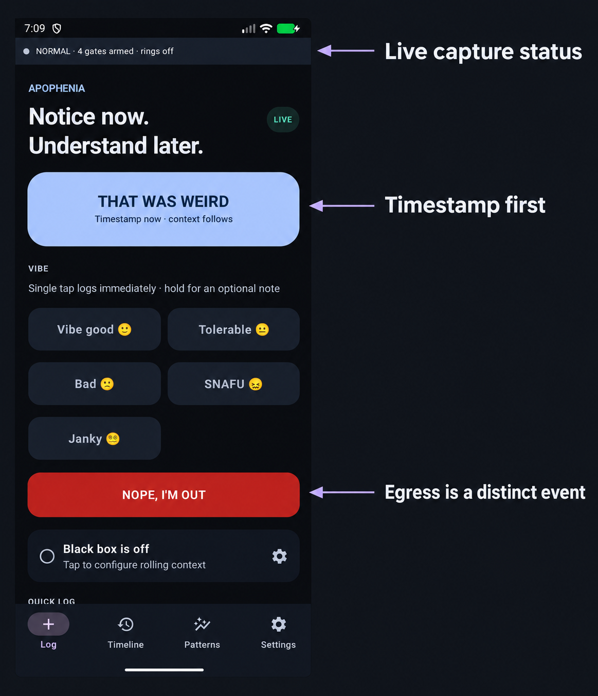
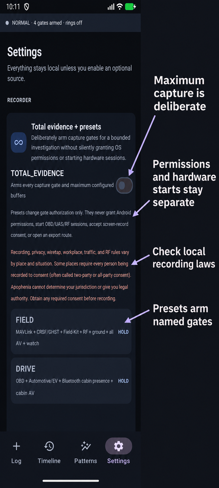
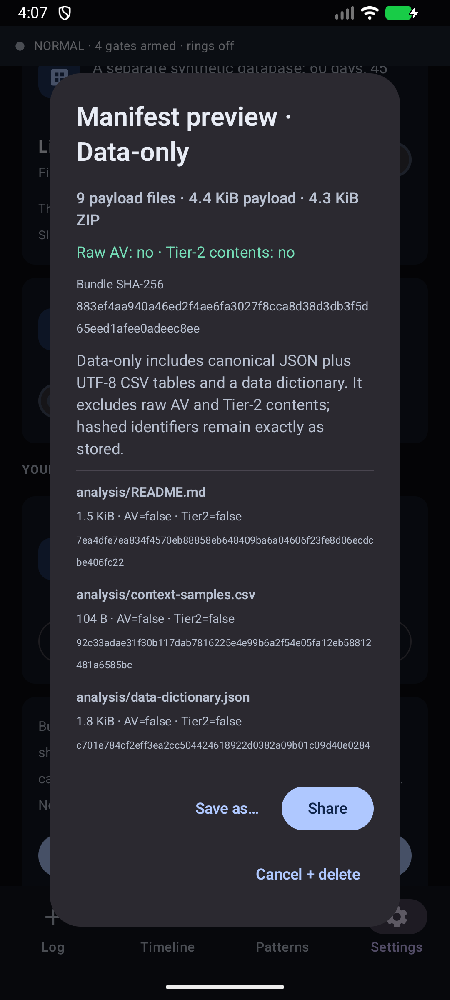

<div align="center">

# Apophenia

### Notice now. Understand later.

**Tap when something feels off. Apophenia saves the moment and the surrounding context you chose.**

[](https://github.com/DroneWuKong/Apophenia/actions/workflows/android.yml)
[](LICENSE)
[](https://developer.android.com/about/versions/oreo)



</div>

## What is this?

Apophenia is a personal black box for Android and Garmin.

If something strange, uncomfortable, interesting, or just worth remembering happens, tap **THAT WAS WEIRD**. The event time is saved immediately. Apophenia then gathers whatever surrounding information you already allowed it to collect—such as phone state, nearby radios, weather, watch data, sound, video, vehicle data, or aircraft telemetry.

Later, you can ask a much better question than “what do I remember?” You can ask **“what was actually happening around that time, and was it different from ordinary moments?”**

The core idea is:

> **You record the event. The software records the circumstances you authorized.**

It can also log how you felt with one tap, from **Vibe good 🙂** through **Janky 😵‍💫**. **NOPE, I'M OUT** records that you left, so “felt bad and stayed” and “felt bad and bailed” remain different kinds of events.

## Yes, it can be extremely invasive

> [!IMPORTANT]
> Apophenia is maximum-invasive **by capability**, but opt-in **by operation**. If you deliberately enable everything, it can record microphone audio, every camera Android can expose, the screen, notifications, calendar, contacts, message metadata, location, physiology, nearby devices, vehicle and aircraft telemetry, and signals received by your own attached hardware.

> **Follow local recording laws.** Recording, privacy, wiretap, workplace, traffic, and RF rules vary by place and situation. Some places require every person being recorded to consent—often called two-party or all-party consent. Apophenia cannot determine your jurisdiction or give you legal authority. Obtain any required consent before recording.

That capability is not hidden or silently enabled:

- Basic event logging works without granting the invasive permissions.
- Every optional source has a named switch, called a **gate**.
- Sensitive gates require an extra deliberate confirmation.
- Android permissions and hardware-session starts are separate from the in-app switch.
- A persistent status bar tells you when capture or a rolling audio/video buffer is live.
- **Everything stays on your device unless you explicitly export it.** There is no account, analytics SDK, automatic cloud sync, or background uploader.
- If Android, the hardware, or the law blocks a channel, Apophenia shows the reason instead of pretending it captured something.

Apophenia is designed as a personal instrument: you are the operator, the owner, and the intended data subject. You are responsible for where and how you use recording features.

## How it works

1. **Notice something.** Tap the app, widget, Quick Settings tile, or Garmin companion. The tap time is saved first.
2. **Freeze the context.** Apophenia attaches the sources you enabled. If the black box is armed, it can preserve the seconds before the tap as well as a clearly labeled period afterward.
3. **Look for differences.** The app compares event windows with ordinary control windows and says when the data is too thin or a possible pattern looks like noise.
4. **Keep it or share it.** Review everything locally, or build a human-readable or machine-readable export and inspect its manifest before it leaves the phone.

### Choose how deep to go

<p align="center">
  
</p>

**TOTAL_EVIDENCE** is the “turn every configured gate up for the next investigation” switch. FIELD, DRIVE, HOME, and EVERYTHING are shortcuts. They arm settings; they do not silently approve Android prompts, start a vehicle or aircraft session, or open an export route.

### Review what happened

<table>
  <tr>
    <td width="50%" align="center"><strong>Your timeline</strong></td>
    <td width="50%" align="center"><strong>Possible patterns</strong></td>
  </tr>
  <tr>
    <td align="center"></td>
    <td align="center"></td>
  </tr>
  <tr>
    <td>Events, vibes, ordinary check-ins, and hypotheses stay visibly separate.</td>
    <td>“Not enough data” and “this may be noise” are valid results, not failures.</td>
  </tr>
</table>

The app also has an **Omniprobe** view for each event. It lists every known channel, the value captured, and the reason for any gap: gate off, permission denied, platform restricted, hardware absent, or a legal restriction.

## What can it record?

Only the categories you choose, and only when the device and platform can provide them.

| Area | Examples |
| --- | --- |
| The moment | Exact tap time, event type, optional note, VIBE rating, and whether you left |
| Phone and surroundings | Battery, network, nearby Wi-Fi/Bluetooth, light, pressure, motion, sound level, weather, solar phase, screen and interaction state |
| Sensitive phone context | Notification, calendar, contact, and message metadata behind deliberate gates and encrypted at rest |
| Body and watch | Read-only Health Connect history and Garmin event/physiology context |
| Audio and video | Encrypted microphone, camera, multicamera, and screen-record rings with visible recording indicators |
| Vehicle | User-started OBD-II drive sessions and available Android Automotive properties |
| Aircraft and field gear | MAVLink flight sessions, CRSF/GHST link health, Field-Kit events, TAK context, weather/space-weather context, and bounded owned-receiver RF windows |
| Ordinary comparison moments | Randomized controls and optional “nothing unusual” check-ins collected through the same pipeline |

Raw nearby-device identifiers are replaced with locally keyed hashes before storage. Raw audio/video can expire while permanent descriptive measurements—such as loudness, spectral energy, motion, brightness, and flicker—remain available for comparison. Retention is configurable, and individual events can be kept forever or scrubbed.

## Exports that people and software can both use

Nothing leaves automatically. An export is built locally, hash-checked, and shown to you as a file-by-file manifest before **Share** or **Save as** becomes available.

<p align="center">
  
</p>

| If you want to… | Use… |
| --- | --- |
| Read or print a clean summary | Self-contained HTML or PDF report |
| Hand one incident to someone | Single-event dossier with a plain-language summary, timeline, charts, and selected evidence |
| Open the data in Excel, LibreOffice, R, or Python | UTF-8 CSV tables plus a data dictionary |
| Preserve structure for code or an AI analysis tool | Canonical JSON plus flat CSV tables |
| Query the original relational data | Checkpointed SQLite `.db` with a documented `schema_version` |
| Make a complete portable backup | Verified ZIP containing the database, selected media, manifests, and SHA-256 hashes |

The default **Data-only** export excludes raw audio/video, sensitive Tier-2 contents, and attachment bytes. A **Full evidence** package can include them, but requires two confirmations and shows the complete manifest first.

Exports can go through Android's normal share sheet, **Save as** to a folder or USB drive, or a separately gated one-shot local-network destination. The export log records what left, when, by which route, and at which content tier.

For analysis examples and tool compatibility, see [Human and machine analysis exports](docs/EXPORT_ANALYSIS.md). For the exact bundle contract, see [Export, backup, restore, and routes](docs/EXPORT.md).

## What the analysis does—and does not—say

Apophenia is built to resist an easy human mistake: noticing a coincidence and immediately turning it into a story.

- Observations and hypotheses are stored separately.
- Dense sensor readings from one event stay grouped as one capture, not hundreds of independent “votes.”
- After-the-event data may be displayed, but it is not treated as a predictor of the event.
- Event windows are compared with ordinary control windows from similar local time blocks.
- The app counts how many possible relationships it tested and marks weak hits that are indistinguishable from noise.
- Results use plain language such as “3× more common at your events than controls,” with clear small-sample warnings.
- You can register a hypothesis before looking at results; it can then be confirmed, not yet supported, or refuted.

Apophenia does not diagnose, prove causation, validate paranormal claims, or turn simulator results into hardware proof. Sometimes its best answer is: **“Good news: this pattern doesn't hold up against your controls.”**

## Try it

Apophenia is a **development preview**, not a Play Store release.

1. Download the `app-debug.apk` from the [0.3.0-preview.4 development pre-release](https://github.com/DroneWuKong/Apophenia/releases/tag/v0.3.0-preview.4), or from a successful [Android CI run](https://github.com/DroneWuKong/Apophenia/actions/workflows/android.yml).
2. Install it on a phone running Android 8.0 or newer. Android may ask you to allow installs from your browser or file manager.
3. Start with the big event button and VIBE choices.
4. Open Settings and enable only the context you actually want.
5. Turn on Demo Data if you want to explore the timeline, analysis, Omniprobe, and export screens without using personal records.

Debug signatures can differ between build machines. If Android rejects an update, export anything you need, uninstall the old debug build, and install the new one. The [install and test guide](docs/INSTALL_AND_TEST.md) includes a short testing checklist and privacy-safe bug-report template.

## What has actually been verified

| Area | Current evidence |
| --- | --- |
| Android build | JDK 17 build, unit tests, lint, and debug APK pass locally and in GitHub Actions |
| Android UI | Eleven Jetpack Compose smoke tests pass on an API 36 emulator, covering demo isolation, Omniprobe, sealed exports, raw-SQLite preview, reports, and inbound shares |
| Optional permissions | Location, notification, weather, and Health Connect flows were exercised in an emulator |
| Garmin | All three Epix Pro targets compile with Connect IQ SDK 9.2.0; six queue tests pass in the 47 mm simulator |
| Physical hardware | Broader phone, watch, radio, OBD, MAVLink, SDR, and field acceptance testing is still required |

The screenshots in this README come from the real debug app on an Android emulator. The wide screenshots add documentation arrows and labels; they are explanatory images, not pixel-perfect test evidence. Timeline entries shown here are demo data, not personal records. Emulator evidence is not physical-device validation.

The detailed evidence boundary and next hardware checklist are in [Project handoff and validation status](docs/PROJECT_HANDOFF.md) and [Physical acceptance](docs/PHYSICAL_ACCEPTANCE.md).

<details>
<summary><strong>Technical feature map</strong></summary>

### Capture and storage

- Timestamp-first app, widget, Quick Settings, inbound-share, Tasker, and Garmin event entry
- SQLite-backed observations, context samples, sessions, hypotheses, export audits, and purge ledger
- Bounded pre/post-event capture windows, random controls, and post-event predictor exclusion
- Locally keyed identifier hashing, encrypted sensitive contents, and per-event encrypted AV artifacts
- Configurable AV retention, keep-forever, scrub, evidence seals, and verified EJECT export-then-wipe

### Context adapters

- Phone sensors, display/interaction, power/thermal, time/solar, network, Wi-Fi, Bluetooth, Wi-Fi Direct, NFC, location, weather, Health Connect, Garmin, and optional Octopod/Home Assistant aggregate context
- OBD-II/ELM327 drive sessions, Android Automotive properties, and adapter-exposed EV values
- MAVLink over UDP/TCP/USB/SiK, CRSF/GHST statistics, Field-Kit detector input, TAK own-track/full-visible modes, NOAA space weather, and bounded `rtl_tcp` survey windows
- Microphone, main/front/concurrent cameras, screen record, capability-labeled call audio, and derived spectral/motion/flicker metrics

### Analysis and sharing

- One-to-one time-block/weekday control matching, robust summaries, confidence intervals, recorded permutation seeds, and false-discovery-rate correction
- Egress/stayed cohorts, per-device presence features, pre-registration, confounder surfacing, plain-language findings, and honest small-sample tiers
- JSON, CSV, data dictionary, SQLite, HTML/PDF report, event dossier, full-evidence, restorable backup, sharesheet, SAF/USB, and gated LAN routes
- Isolated 60-day demo fixture with a persistent DEMO DATA badge and exclusion from live exports

</details>

<details>
<summary><strong>Build it yourself</strong></summary>

Requirements: JDK 17 and Android SDK API 37.

Windows:

```powershell
./gradlew.bat testDebugUnitTest lintDebug :app:assembleDebug
./gradlew.bat connectedDebugAndroidTest
```

macOS or Linux:

```bash
./gradlew testDebugUnitTest lintDebug :app:assembleDebug
./gradlew connectedDebugAndroidTest
```

The APK is written to `app/build/outputs/apk/debug/app-debug.apk`. No Garmin hardware, GPS fix, weather service, or Health Connect data is required for the software-only test path.

</details>

## Guides and reference

Start with the illustrated [user guide](docs/USER_GUIDE.md), also available as [PDF](docs/Apophenia_User_Guide.pdf), [Word](docs/Apophenia_User_Guide.docx), and [standalone HTML](docs/Apophenia_User_Guide.html).

| Topic | Documentation |
| --- | --- |
| Privacy and control | [Privacy posture](docs/PRIVACY.md) · [Capture gates](docs/CAPTURE_GATES.md) · [TOTAL_EVIDENCE and presets](docs/TOTAL_EVIDENCE.md) · [Omniprobe](docs/OMNIPROBE.md) |
| Data and analysis | [Data model](docs/DATA_MODEL.md) · [Engine credibility](docs/ENGINE_CREDIBILITY.md) · [Hypothesis pre-registration](docs/HYPOTHESIS_PREREGISTRATION.md) · [Plain-language results](docs/PLAIN_LANGUAGE_AND_CONFOUNDERS.md) |
| Audio/video | [Audio ring](docs/AUDIO_RING.md) · [Video, screen, and call audio](docs/VIDEO_SCREEN_CALL.md) · [Retention and playback](docs/AV_RETENTION.md) |
| Phone and surroundings | [Phone context](docs/PHONE_CONTEXT.md) · [Bluetooth](docs/BLUETOOTH_CONTEXT.md) · [Radio context](docs/RADIO_CONTEXT.md) · [Encrypted sensitive contents](docs/TIER2_CONTENTS.md) · [Home context](docs/HOME_CONTEXT.md) |
| Vehicle and aircraft | [OBD-II](docs/VEHICLE_OBD.md) · [Android Automotive](docs/VEHICLE_AUTOMOTIVE.md) · [MAVLink](docs/MAVLINK.md) · [Control links, Field-Kit, and TAK](docs/UAS_LINKS_FIELD_KIT_TAK.md) · [Ground and RF survey](docs/GROUND_RF_SURVEY.md) |
| Export and automation | [Export contract](docs/EXPORT.md) · [Analysis formats](docs/EXPORT_ANALYSIS.md) · [Reports](docs/REPORTS.md) · [Automation and inbound shares](docs/AUTOMATION.md) · [SQLite schema](docs/SCHEMA.md) |
| Project and development | [Architecture](docs/ARCHITECTURE.md) · [Demo mode](docs/DEMO_MODE.md) · [Garmin](docs/GARMIN_EPIX_PRO.md) · [Roadmap](ROADMAP.md) · [Contributing](CONTRIBUTING.md) · [Security](SECURITY.md) |

## License and disclaimer

Apophenia is available under the [MIT License](LICENSE).

It is an experimental personal data tool, not a medical device. It does not diagnose, treat, predict, or explain a medical or mental-health condition. Statistical output is exploratory and may reflect chance, bias, missing data, or confounding factors.
