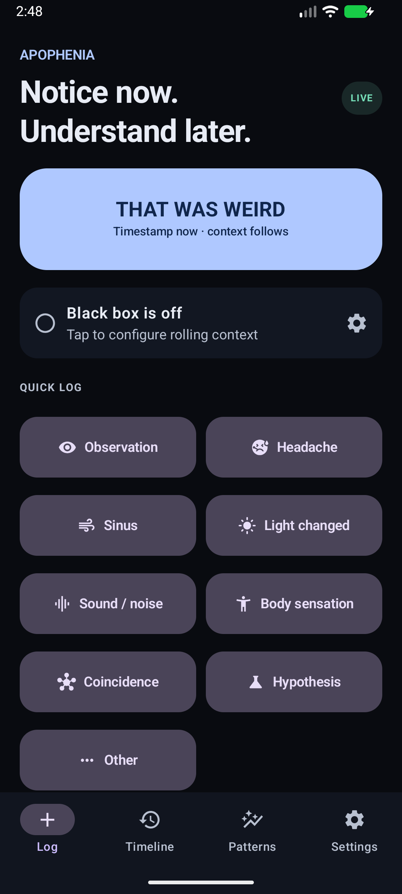
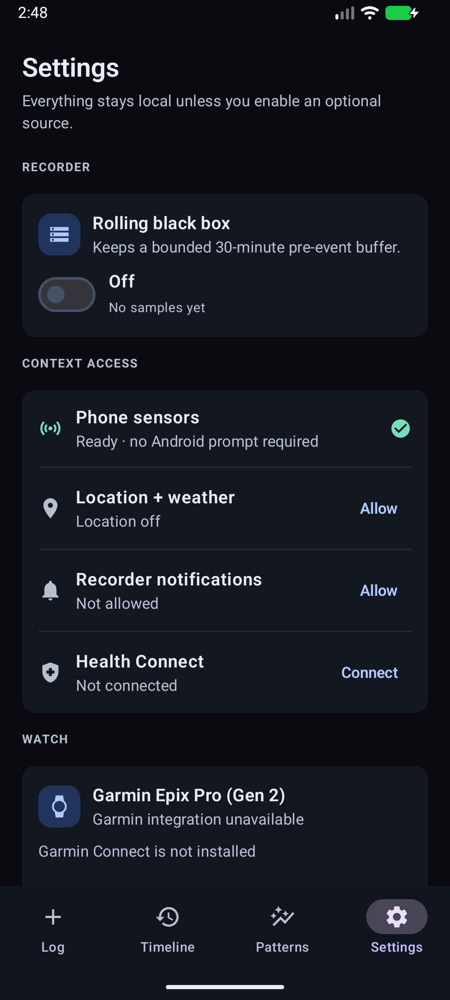
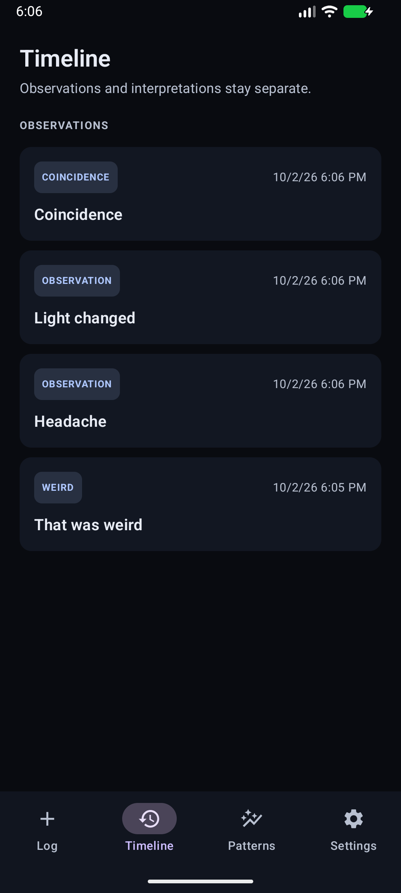
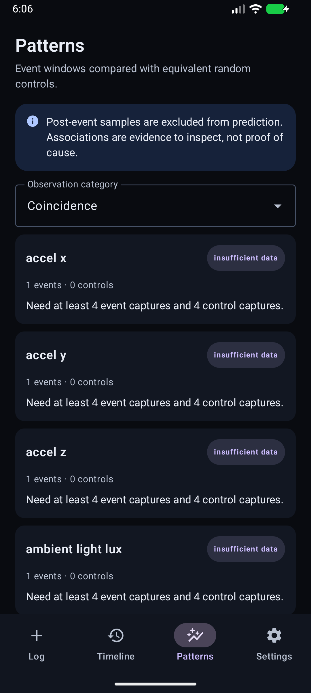
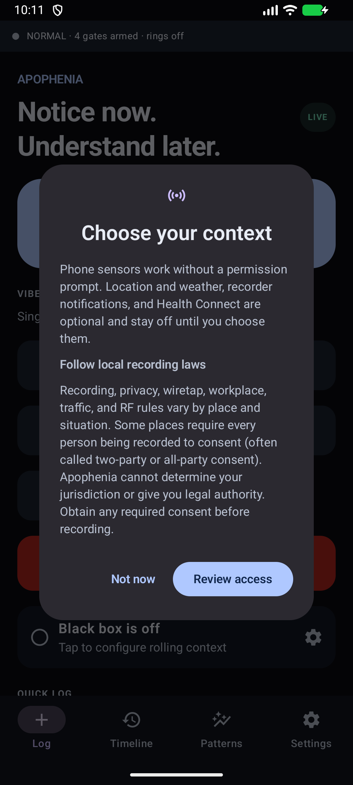

<div align="center">

# Apophenia

### Notice now. Understand later.

**I made a local-first Android + Garmin black box for the moments you want to investigate later.**

[](https://github.com/DroneWuKong/Apophenia/actions/workflows/android.yml)
[](LICENSE)
[](https://developer.android.com/about/versions/oreo)



</div>

## I built this because

I kept having moments that were easy to notice and hard to reconstruct later: a headache, a light or sound changing, an odd coincidence, or simply *that was weird*.

Writing down an explanation afterward is easy. Capturing what was actually happening at the time is harder. Apophenia is my attempt to make that part nearly effortless:

1. Tap once.
2. Save the exact event time immediately.
3. Add whatever optional phone, environment, radio, Health Connect, Garmin, or aggregate home context is available afterward.
4. Compare event windows with ordinary control windows instead of eyeballing a chart and declaring a pattern.

The point is not to prove a story. It is to collect better evidence before telling one.

## The 10-second tour

<table>
  <tr>
    <td width="33%" align="center"><strong>Choose the context</strong></td>
    <td width="33%" align="center"><strong>Review the evidence</strong></td>
    <td width="33%" align="center"><strong>Test the pattern</strong></td>
  </tr>
  <tr>
    <td align="center"></td>
    <td align="center"></td>
    <td align="center"></td>
  </tr>
  <tr>
    <td>Location, weather, notifications, Health Connect, Garmin, and the rolling recorder are visible, optional choices.</td>
    <td>The timeline labels observations, coincidences, and hypotheses instead of mixing them together.</td>
    <td>The analysis says “insufficient data” when that is the honest answer and excludes post-event samples from prediction.</td>
  </tr>
</table>

<details>
<summary><strong>First launch: no surprise permissions</strong></summary>

<br>

<p align="center">
  
</p>

The app explains what works without a prompt and lets you review optional access when you are ready. Basic logging does not depend on location, weather, Health Connect, Garmin, or physical sensors.

</details>

> The screenshots above were captured from the real debug app on an Android emulator. Timeline entries are demo data, not personal records. They are not evidence of physical-device validation.

## What I made

- A **THAT WAS WEIRD** button that timestamps first and enriches second
- One-tap graded VIBE capture plus a distinct red **FUCK THIS, I'M OUT** egress event in the app and widget
- Quick logging for observations, headache, sinus/congestion, light, sound, body sensations, coincidences, hypotheses, and custom entries
- A home-screen widget and Quick Settings tile
- Local SQLite storage, JSON export, and delete controls
- A user-enabled rolling black box with 30 minutes of pre-event context and a labeled post-event window
- Random control captures that use the same pipeline as event captures, then match one-to-one by local time block and weekday/weekend
- Optional neutral check-in prompts that let you record “nothing unusual” through the control pipeline
- Optional phone sensors, device state, battery, network, location, and Open-Meteo weather context
- Optional read-only Health Connect history
- A Garmin Epix Pro (Gen 2) logger with watch timestamps and a bounded offline queue
- Durable watch receipts: events leave the queue only after Android confirms local storage
- Optional aggregate home context through an existing Octopod/Home Assistant cluster
- Gate-backed Wi-Fi and Bluetooth presence with locally keyed identifier hashes, plus network/connectivity state
- Independent audio-state, display/interaction, power/thermal, time/solar, Wi-Fi Direct, and NFC snapshot gates
- Deliberate notification, calendar, contacts, and message-metadata gates with encryption before SQLite persistence
- User-started OBD-II `DRIVE_SESSION` capture through a paired ELM327-style Bluetooth adapter, with a persistent live indicator and hashed adapter identity
- A full simulation mode that exercises storage, rolling windows, controls, and analysis without hardware
- Cautious event-vs-control analysis with robust summaries, recorded permutation seeds, confidence intervals, p-value resolution, and false-discovery-rate correction

There is no account, advertising SDK, analytics, continuous microphone recording, or camera recording.

## Try it

Apophenia is currently a **development preview**, not a Play Store release.

1. Prefer the tagged [0.3.0-preview.4 development pre-release](https://github.com/DroneWuKong/Apophenia/releases/tag/v0.3.0-preview.4), or open the latest successful [Android workflow run](https://github.com/DroneWuKong/Apophenia/actions/workflows/android.yml).
2. Download `app-debug.apk` from the pre-release, or unzip the workflow's `apophenia-debug-apk` artifact.
3. Open `app-debug.apk` on an Android 8.0 or newer phone.
4. Allow installation from the browser or file manager if Android asks.
5. Start with basic logging, then enable only the optional context you want.

GitHub may require a sign-in to download Actions artifacts. Debug signatures can differ between build machines; if Android rejects an update, export anything you need, uninstall the previous debug build, and install the new one.

The [install and test guide](docs/INSTALL_AND_TEST.md) has a short remote-testing checklist and a privacy-safe bug-report template.
For recorder survival and real Garmin delivery, use the [48-hour physical acceptance checklist](docs/PHYSICAL_ACCEPTANCE.md).

## What is real today

| Area | What has actually been verified |
| --- | --- |
| Android | JDK 17 build, unit tests, lint, and debug APK pass locally and in GitHub Actions |
| UI | Three Jetpack Compose smoke tests pass on an API 36 emulator |
| Permissions | Location, notification, weather, and Health Connect flows were exercised in an emulator |
| Garmin | All three Epix Pro targets compile with Connect IQ SDK 9.2.0 |
| Garmin queue | Six native Monkey C tests pass in the 47 mm simulator |
| Hardware | Broader physical phone/watch acceptance testing is still needed |

I am deliberately not calling simulator evidence hardware validation. The detailed evidence boundary and remaining acceptance work live in [PROJECT_HANDOFF.md](docs/PROJECT_HANDOFF.md).

## The part I care about most

Apophenia has a few non-negotiable rules:

- observations are evidence, not conclusions;
- hypotheses stay separate from raw observations;
- event windows are compared with one-to-one controls matched by local four-hour block and weekday/weekend;
- dense sensor samples are grouped by window, not counted as independent events;
- post-event samples may be explored but are not predictors of the event;
- unavailable metrics are omitted, never invented;
- correlation is never presented as proven causation, diagnosis, or a paranormal claim.

That means the app is allowed to say **insufficient data**. In fact, it should say that a lot at first.

The matching is intentionally modest: it reduces obvious time-of-day and weekday confounding, but it does not yet match activity, location, sleep/wake state, or attention. Optional neutral check-ins help measure moments when nothing unusual was noticed, but they do not eliminate self-selection bias.

## Under the hood

```text
tap / widget / tile / Garmin event
              |
              v
     save exact event timestamp
              |
              +--> freeze preceding rolling window
              +--> collect available instant context
              +--> schedule labeled post-event context
              +--> store everything locally
                           |
                           v
             compare event windows with controls
```

The Android app is native Kotlin with Jetpack Compose and SQLite. Hardware and external-service adapters sit behind explicit LIVE/SIMULATION gates so the same core pipeline can run entirely in software.

The Garmin companion targets:

- `epix2pro42mm`
- `epix2pro47mm`
- `epix2pro51mm`

It preserves the watch's original timestamp, omits unavailable metrics, and queues events when the phone is temporarily disconnected. A phone-storage receipt removes an event only after Android commits it; a lost receipt produces a safe deduplicated retry instead of silent loss.

## Build it yourself

Requirements:

- JDK 17
- Android SDK with API 37 installed

Windows:

```powershell
./gradlew.bat testDebugUnitTest lintDebug :app:assembleDebug
./gradlew.bat connectedDebugAndroidTest
```

macOS or Linux:

```bash
./gradlew testDebugUnitTest lintDebug :app:assembleDebug
./gradlew connectedDebugAndroidTest
```

The debug APK lands at:

```text
app/build/outputs/apk/debug/app-debug.apk
```

No Garmin hardware, GPS fix, weather service, or Health Connect data is required for the software test path.

## Privacy

Everything is local-first. Optional access is explicit and fail-soft, and export only happens when you choose a share destination. Do not attach real exports, coordinates, health records, or observation notes to a public issue.

Read the full [privacy and collection boundaries](docs/PRIVACY.md).

## Want to poke at it?

Bug reports, Android vendor compatibility results, UI feedback, cautious-analysis ideas, and focused pull requests are welcome. The most useful feedback right now is listed in [CONTRIBUTING.md](CONTRIBUTING.md).

If you want to share the project, there is a copy-ready [Reddit launch kit](docs/REDDIT_LAUNCH.md) with honest validation language and a posting checklist.

## Project docs

- [Architecture](docs/ARCHITECTURE.md)
- [Data model and statistical boundaries](docs/DATA_MODEL.md)
- [Capture gates and consent tiers](docs/CAPTURE_GATES.md)
- [Quick VIBE capture](docs/QUICK_VIBE.md)
- [Install and remote test guide](docs/INSTALL_AND_TEST.md)
- [Garmin Epix Pro integration](docs/GARMIN_EPIX_PRO.md)
- [Optional Octopod home context](docs/HOME_CONTEXT.md)
- [Optional radio context](docs/RADIO_CONTEXT.md)
- [Bluetooth presence channel](docs/BLUETOOTH_CONTEXT.md)
- [Wi-Fi, network, and auxiliary presence channels](docs/PHONE_CONTEXT.md)
- [Encrypted Tier-2 content channels](docs/TIER2_CONTENTS.md)
- [OBD-II drive sessions](docs/VEHICLE_OBD.md)
- [Project handoff and validation status](docs/PROJECT_HANDOFF.md)
- [Roadmap](ROADMAP.md)
- [Release checklist](docs/RELEASE_CHECKLIST.md)
- [Release notes](docs/RELEASE_NOTES_0.2.1.md)
- [0.3.0-preview.3 release notes](docs/RELEASE_NOTES_0.3.0-preview.3.md)
- [0.3.0-preview.4 release notes](docs/RELEASE_NOTES_0.3.0-preview.4.md)

## License and disclaimer

The source is available under the [MIT License](LICENSE).

Apophenia is an experimental personal data tool, not a medical device. It does not diagnose, treat, predict, or explain a medical or mental-health condition. Statistical output is exploratory and may reflect chance, bias, missing data, or confounding factors.
