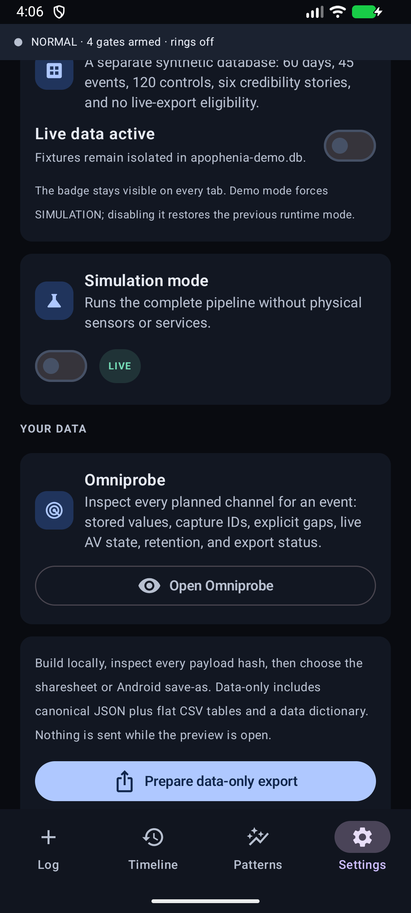

# Apophenia total capture user guide

Apophenia is a personal, local-first total-capture instrument. It is built for a specific question: **what was going on around the moment I logged this?** You create the timestamped observation. The app freezes the phone, environment, radio, physiology, vehicle, aircraft, AV, and other context that you deliberately authorized, then compares event windows with ordinary controls.

The app is capable of being **maximum invasive**. That means the capability ceiling includes audio, video from every camera Android can expose, screen contents, notifications, messages, calendar, contacts, location, physiology, nearby radios, vehicle telemetry, aircraft telemetry, control-link statistics, and bounded RF-receiver windows. It does not mean those channels run automatically.

**Follow local recording laws.** Recording, privacy, wiretap, workplace, traffic, and RF rules vary by place and situation. Some places require every person being recorded to consent, often described as two-party or all-party consent. Apophenia cannot determine your jurisdiction or give you legal authority. Obtain any required consent before recording.

Four boundaries remain separate:

1. A named Apophenia gate must be enabled.
2. Android permission or screen-capture consent must be granted where the platform requires it.
3. A live session or AV ring must be armed where the channel has an active operating state.
4. Data remains local until an export is built, previewed, and deliberately routed.

## Capture a moment

- **THAT WAS WEIRD** records the tap time first, then captures available context.
- **VIBE** is a one-tap 1-5 graded state. Holding an option opens the app with the timestamp already stamped so a note can be added without changing the event time.
- **NOPE, I'M OUT** is not just a high VIBE score. It records `VIBE=5` plus `egress=true`, so analysis can distinguish leaving from feeling bad and staying.
- The top strip reports the armed-gate count and whether AV rings are actually live. A gate count is not a claim that its hardware, permission, or service is available.

## Choose how invasive the next session should be

The app exposes a door for every supported channel. Gates are authorization records, not silent permission grants.

| Control | What it does | What it does not do |
| --- | --- | --- |
| Individual gate | Authorizes one named capture capability | It does not bypass Android or start a session that requires a start action |
| TOTAL_EVIDENCE | Arms every capture gate and maximum configured buffers | It does not grant OS permissions, start OBD/UAS/RF sessions, accept screen-record consent, or open an export route |
| FIELD preset | Arms MAVLink, CRSF/GHST, Field-Kit, RF, ground context, AV, and watch gates | It does not claim a receiver, aircraft, radio, camera, or watch is physically present |
| DRIVE preset | Arms OBD, Automotive/EV, cabin Bluetooth presence, and cabin AV gates | It does not connect to an adapter or start a drive session |
| HOME preset | Arms phone and environmental context | It does not configure the separate Octopod endpoint |
| EVERYTHING preset | Arms every capture gate and maximum ring settings | It still excludes the export-LAN gate and cannot send data |

Tier 1 gates use one confirmation. Tier 2 gates require an exact-name or hold confirmation for microphone, cameras, screen, notifications, calendar, contacts, and message contents. Tier 3 channels remain implemented but activate only when platform, hardware, and applicable law allow. Omniprobe records a gap instead of inventing a value.

## Understand what is stored

Ordinary observations, scalar context, controls, sessions, derived media metrics, hypotheses, and audit records live in local SQLite. Raw device identifiers are not durable fields; the app stores locally keyed hashes for BSSIDs, Bluetooth addresses, adapters, and airframe IDs.

Tier 2 contents and retained AV use device-local encryption. Raw media has a retention deadline, 14 days by default. A per-event keep-forever setting can preserve it. Scrub or expiry removes media ciphertext, its manifest, and the event key while leaving non-reconstructive derived metrics and a purge-ledger receipt.

The threat model is information loss, but the capture state is still explicit:

- AV buffering and drive, flight, or control-link sessions show persistent indicators;
- raw AV buffering is bounded and continuously pruned;
- capture occurs at event/control windows and active sessions, not as an unlimited background archive;
- the app has no account, advertising SDK, analytics SDK, automatic cloud sync, or background uploader.

## Inspect an event with Omniprobe

Omniprobe is the evidence inventory. For each planned channel it shows the stored value and `capture_id`, or one of the explicit gap reasons: gate off, permission denied, platform restricted, hardware absent, or statute. It also shows AV ring state, retention countdowns, evidence seals, and export audit status.

Omniprobe is not an export. Viewing protected contents locally creates no plaintext file and sends nothing.

## Export for a person or an analysis tool

The app builds every artifact in private cache and verifies every declared SHA-256 before the preview opens. The preview is still local.

| Export | Best for | Human formats | Machine formats |
| --- | --- | --- | --- |
| Data-only | Routine analysis without raw evidence | analysis README, CSV tables | canonical JSON, CSV, JSON data dictionary |
| Full evidence | Complete portable copy | analysis README and inventories | JSON/CSV plus retained AV, Tier 2 plaintext, attachments, RF, and hashes |
| Raw SQLite | Direct SQL, BI, or forensic tooling | documented schema | checkpointed `.db` with integrity and version checks |
| Single-event dossier | Reconstructing one moment | plain-language summary, SVG chart | event JSON, context CSV, inventories, retained evidence |
| Selected-event report | Showing a professional or reviewing a cohort | self-contained HTML and PDF | report JSON, context CSV, SVG chart |
| Full backup | Verified migration and restore | manifest and restore status | SQLite plus portable evidence and nested manifests |

The default data-only ZIP excludes raw AV, Tier 2 contents, and inbound attachment bytes. The full-evidence ZIP materializes device-bound encrypted evidence into portable plaintext and therefore uses two confirmations. The exact files, sizes, hashes, and AV/Tier 2 flags are visible before a route is available.

Routes are Android sharesheet, Android Save as, or the separately gated local-LAN action. SMB/NFS access comes from a document provider selected by the operator. Direct HTTP(S) accepts only literal local/private addresses and never runs as a background retry worker.

Read [EXPORT_ANALYSIS.md](EXPORT_ANALYSIS.md) for format details and safe analysis rules. Read [EXPORT.md](EXPORT.md) for the complete manifest, routing, backup, seal, audit, and EJECT contract.

## Analyze without fooling yourself

- Treat `capture_id`, not a dense sensor row, as the unit of independence.
- Exclude `phase=POST` from predictor calculations.
- Compare event captures with jittered controls captured through the same pipeline.
- Keep observations descriptive and hypotheses separate.
- Count every channel tested and apply the reported multiple-comparisons correction.
- Treat a refuted preregistered pattern as a useful result.
- Do not promote association to causation, diagnosis, or explanation.

Simulator and emulator results prove software behavior only. They do not prove physical phone sensors, camera concurrency, microphones, radios, adapters, vehicle properties, aircraft links, SDR hardware, watch delivery, field performance, or flight performance. The dated physical-validation list is maintained in [PROJECT_HANDOFF.md](PROJECT_HANDOFF.md).
